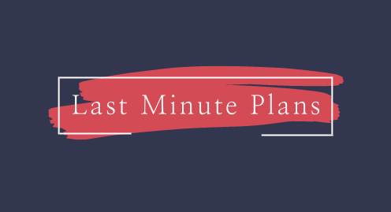
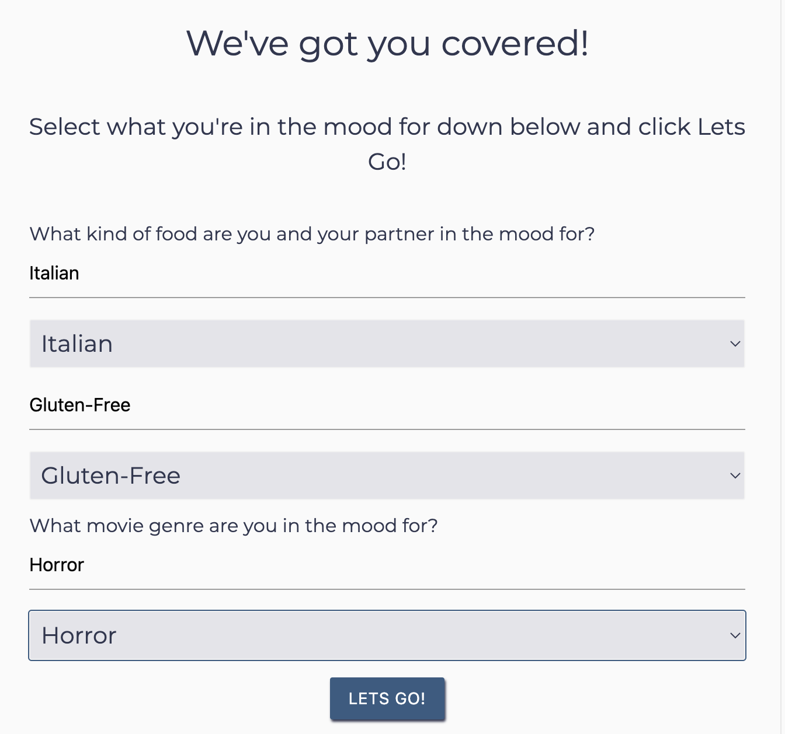
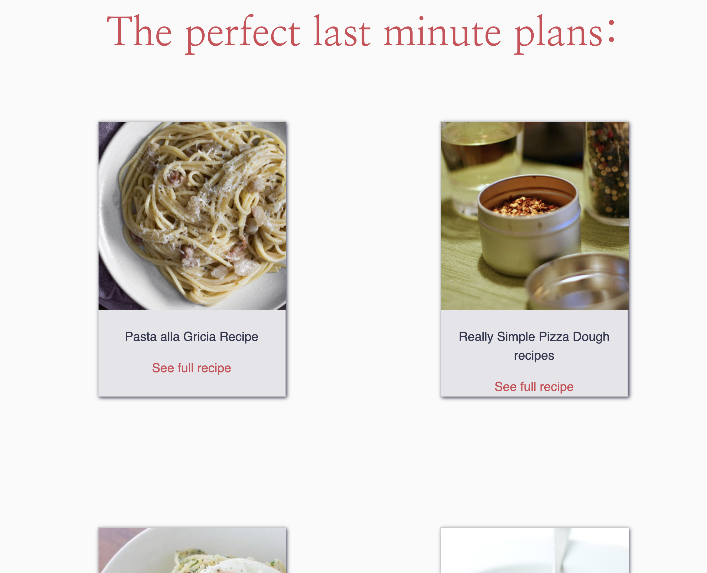

    

## 

Last Minute Plans is an app to put an end to the age old question, "I don't know, what do you want to do?"

Our application is designed to take out the pressure and hassle of deciding what to cook and what to watch so you can spend more time enjoying your evening. 

One challenge of creating this app was found in displaying results from the recipe and movie APIs. The ability to automate the API on a button click came down to crafting functions to apply the selected options on the main page with query selectors. 
We struggled to implement a functional for loop to render 6 items from the API return data. In the end, we successfully added a for loop to create more efficiency and smoothness in rendering. 
An additional challenge of this project was working with Materialize CSS. Uncovering the quirks of this technology was essential to the final aesthetic and feature functionality of the app itself. 
After running into several issues initializing Materialize CSS Dropdown menus, the team discovered that they could revert back to their original HTML structure by using option select menus, an alternative form of dropdown menu styled by Materialize CSS. When the app looks good, so does our last-minute casanova.

For future versions of this application, we would like to add a "Feeling Frisky," button, which would generate a random combination of movie and recipe, for the truly undecided or adventurous user. 
We would also like to implement a “Favorites” page using local storage to keep track of all the good plans you’ve made before.

As it stands, Last Minute Plans is your go-to for a nice date night in. The fill-in-the-blanks for the uninspired, and the spice for the thrill-seeker, Last Minute Plans provides a unique experience for all.

## 

No installation is necessary for this app. Access the application at https://boushka9.github.io/last-minute-plans/ 

## 

1. Select cuisine type and dietary restrictions, and desired movie genre from dropdown menus to narrow down your search parameters
    - Click 'Let's Go!' to view your movie and recipe suggestions

2. To view the entire recipe, click on the recipe link at the bottom of each card

## 

* Emma Boushka - Lead Developer, Graphic Design, Javacript, CSS, Local Storage
* Joshua Boren - API selection, implementation, and activation, JavaScript
* Christian Killelea - HTML and Front End design
* Samantha Gosselin - Front End Assistance, Modal Notifications, Materialize Integration, presentation and ReadMe

## 

* 0.1
    * Initial Release

## 

Inspiration, code snippets, etc.
* [awesome-readme](https://github.com/matiassingers/awesome-readme)
* [Materialize for CSS](https://materializecss.com/)
* [Edimam](https://www.edamam.com/)
* [The Movie Database API](https://www.themoviedb.org/)
* [W3 Schools "How to CSS/Modal"](https://www.w3schools.com/howto/howto_css_modals.asp)
* [Challenge 6, the Weather App Project](https://boushka9.github.io/rainy-plastic-plants/)

## 

    
     
    

