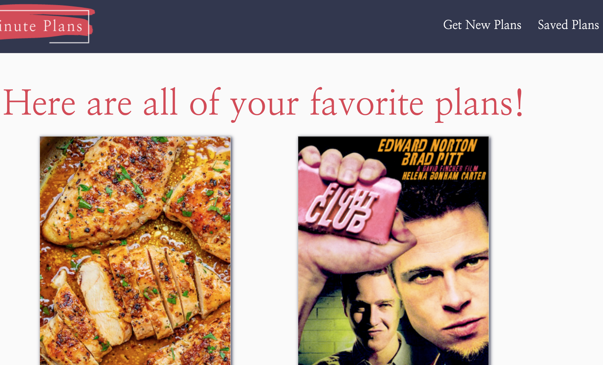

# Last Minute Plans

## Description

Last Minute Plans is an app to put an end to the age old question, "I don't know, what do you want to do?"

Designed to generate recipes and movie suggestions, you have the option of generating a set of plans specific to a cuisine and a genre respectively. 

If you're "feeling frisky," click the button to generate a random combination of movie and recipe and let fate decide!

Your results will be displayed on the next page.

Find something you love? Click the favorites button to save a movie or recipe you'd like to revisit. Clicking the (MY FAVORITES) button will bring you to all the movies and recipes that you've saved in the past so you can find them easily.

## Wire Frames and User Story

### User Story
As a couple with no plans
I want to see suggested recipes and movies
So that we can make date plans at the last minute

### Acceptance Criteria
GIVEN I am presented with the Last Minute Plans application,
WHEN I select search criteria for dinner and a movie,
THEN I am presented with 5 recipes and 5 movie suggestions
WHEN I click the option to randomize selection,
THEN I am presented with one movie/dinner combination
WHEN I click the option to save a recipe or movie to My Favorites
THEN My selections will appear on the "My Favorites Page" in the app

### Wire Frames

Last Minute Plans Main Page

Last Minute Plans Results Page

Last Minute Plans Favorites Page

## Authors

* Emma Boushka - Administrator, Graphic Design, Javacript, Local Storage
* Joshua Boren - API implementation, JavaScript
* Tiffany Springer - CSS and Materialize
* Christian Killelea - HTML and Front End
* Samantha Gosselin - Front End Assistance, Modal Notifications, presentation and ReadMe

## Version History

* 0.1
    * Initial Release

## Acknowledgments

Inspiration, code snippets, etc.
* [awesome-readme](https://github.com/matiassingers/awesome-readme)
* [Materialize for CSS](https://materializecss.com/)
* [Edimam](https://www.edamam.com/)
* [The Movie Database API](https://www.themoviedb.org/)
* [W3 Schools "How to CSS/Modal"](https://www.w3schools.com/howto/howto_css_modals.asp)
* [Challenge 6, the Weather App Project](https://boushka9.github.io/rainy-plastic-plants/)
